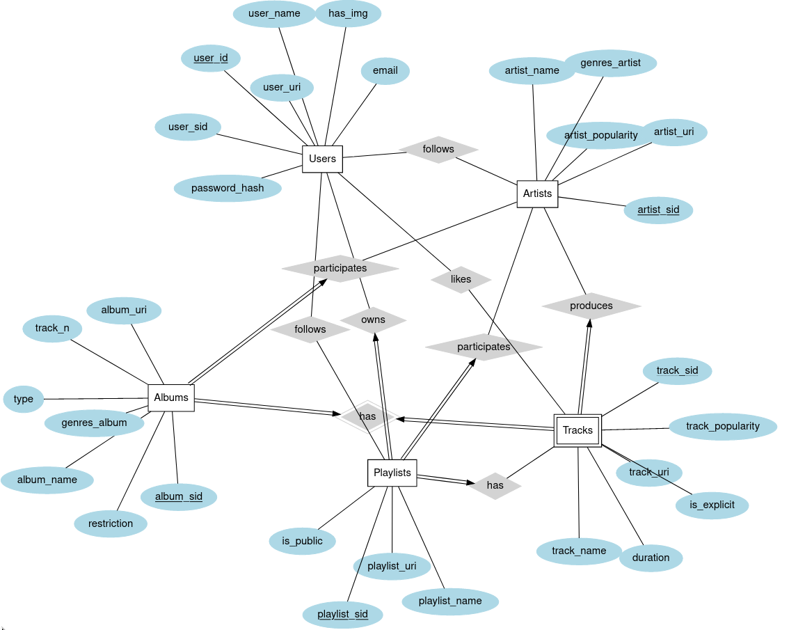
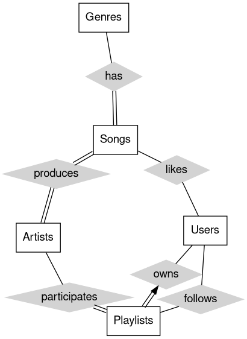
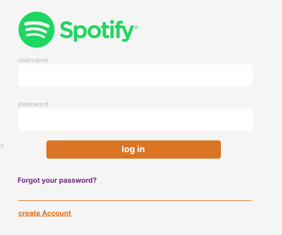

# The Music Database

### Integrantes:

   - Enrique Francisco Flores Teniente

   - Santiago Adolfo Uribe Guerra

   - Jhimy Jhoel Delgado Bazan

### Introducción:
El proyecto (The Music Database) se basa en una página web que permite crear usuarios, iniciar sesión y registrarlos en una base de datos ya sea sus canciones y playlist.

### Objetivo princpial:
Nuestro objetivo es manipular las playlist y canciones de Spotify que pertenezcan a una determinada cuenta.

### Recursos empleados:

### API 
   - #### API Spotify: 
      La API de Spotify proporciona un conjunto de puntos finales, cada uno con su propia ruta única relacionada con el usuario, como listas de reproducción y música         que el usuario ha almacenado en su biblioteca de música. Este acceso es proporcionado por el permiso selectivo del usuario.
### Librerías
   - #### pipenv
   - #### Figma
   - #### Tailwind CSS

### Framework
   - #### Flask
   
### Hosts:

### Manejo de errores HTTP:
   - 500: Se ha aceptado el request exitosamente.
   - 302: Recurso solicitado ha sido movido temporalmente a la URL
   - 400: Recurso mal solicitado.
   - 401: Petición no ejecutada por falta de autorización.
   - 404: Recurso no encontrado.
   - 405: Método a ejecutar no permitido.
   - 500: Error por fallo en la aplicación.
   

*Entity-Relation Diagram*

*Old Entity-Relation Diagram*

*Authorization Code Flow*

*Login Mockup*

## TODO

1. Mockup
    * **Navbar & colorscheme**
    * About page
    * Log in
    * Single playlist visualize
    * Main/account overview

